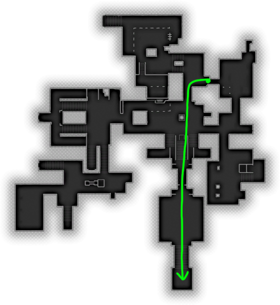
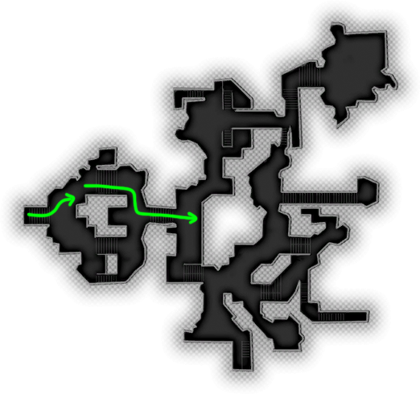
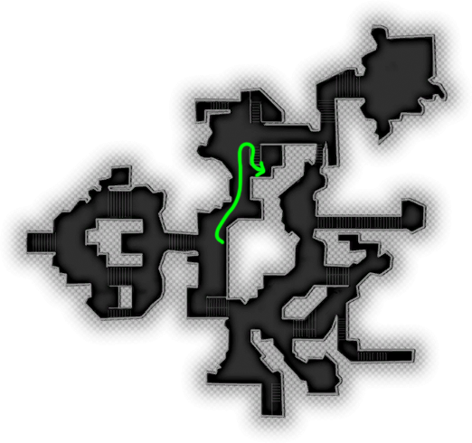

# Act 1

## A New Home?

<Float float='right' marginTop='-5rem'>
    
</Float>

Complete Aveline’s Recruitment Quest ([A Friend in the Guard](https://dragonage.fandom.com/wiki/A_Friend_in_the_Guard))\
Go south and enter the Viscount’s Keep, Aveline will be in the guard’s room on the right hand side. Speak to Aveline, which will complete the quest.

<Float float='left'>
    
</Float>

Exit to Lowtown (Day).\
Take the left path and sell all weapons at the Apparel Shop.\
Enter the Hanged Man.\
Hold Position with party members, swap to Bethany (F2) then talk to Varric.
After dialogue, Exit to Lowtown (Day).

<Float float='right' marginTop='-1rem'>
    
</Float>

Walk north and enter Gamlen’s House.\
Enter the room on the right, interact with the Special Deliveries chest and take all the items.\
Exit to Hanged Man, then exit to Lowtown (Day)   <Party game='DA2' character1='Varric' character2='Aveline' character3='Bethany'/>
Level up characters:\
Hawke: 13 cunning, 21(?) willpower (1 point in Cunning, point dump into Willpower)\
Autolevel Bethany and Varric.
**DON’T** autolevel Aveline.\
<Tooltip tooltip="Cross Class Spell Swap"> [CCSS](../../03-strats/02-cross-class-spell-swap.mdx)</Tooltip> <Ability game="DA2" name="Cone of cold"/>, and <Ability game="DA2" name="Heal"/> if you need it for safety from Bethany.
<Tooltip tooltip="Cross Class Spell Swap"> [CCSS](../../03-strats/02-cross-class-spell-swap.mdx)</Tooltip> <Ability game="DA2" name="Bolster"/> from Aveline

<!-- 
For anyone reading this file by itself:

Equip on Hawke:
    Weapon: 
        Adder of Antiva
    Accessories:
        Dura's Blue Flame
        Air of Confidence
        Ring of Resilience
        The Irons
    Armour:
        Smuggler's Scale and Banding
    
Equip on Bethany:
    Weapon:
        Staff of Parlathan
 -->

| Equip on: | Hawke | Bethany |
|-----------|-------|---------|
|  | Weapon:<ul><li>Adder of Antiva</li></ul> | Weapon: <ul><li>Staff of Parlathan</li></ul> |
|  | Accessories:<ul><li>Dura's Blue Flame</li><li>Air of Confidence</li><li>Ring of Resilience</li><li>The Irons</li></ul> ||
|  | Armour:<ul><li>Smuggler's Scale and Banding</li></ul> ||

Enter Lirene’s Fereldan Imports, talk to Lirene.\
Exit, let Bethany handle the mob (4)

## A Long Way Home

Travel to Sundermount. (Not Ambush Site)\
Follow the path until you meet some spiders.\
Hit as many of them as possible (ideally all) with <Ability game="DA2" name="Cone of cold"/>, then use <Ability game="DA2" name="Winters Grasp"/> on the Corrupted Spider. Keep going west as Hawke towards the Dalish Camp while your party finishes combat with the Corrupted Spider.\
After the dialogue with the camp guards you can do either of the following strats:
:::hard Conversation Glitch - easier on lower fps

(Video: https://clips.twitch.tv/BoringAltruisticToadSaltBae)
(Video 2: https://www.youtube.com/watch?v=MtXtedxLnFU)

Keep going west and exit to the Hanged Man.\
Hold Position on party members.\
Walk up to Corff the Bartender with Hawke.\
Swap to a character close to the door, make a quicksave.\
Interact with the exit, then pause immediately after before the map screen shows up.\
Swap back to Hawke.\
Unpause and interact with Corff at the same time. \
Dialogue shouldn’t pop up, then travel to Sundermount.\
You know you’ve succeeded when you get a longer loading screen than normal while travelling to Sundermount.\
Once in Sundermount you’ll get the dialogue with Corff (3), which puts you at the top of the mountain.
:::

:::easy
Follow the path north up the mountain
Dialogue with Merrill, keep following the path and ignore enemies
Dialogue with the rude elf towards the top, keep going north and enter the Sundermount Passage.
2 waves of enemies in the first room.
2 waves of enemies in the second room.
Enter Mountain Graveyard.
:::

Interact with Barrier, walk up to Altar.
Kill enemies that spawn.
QRD with Altar, completing Long Way Home. (32 Gold and 3200 XP)
Return north and Return to Camp

## Tranquility

Lowtown (Day)
Swap out Bethany with Merrill.
Learn Chain Lightning and Tempest on Merrill.
Equip Apostate’s Courage on Merrill.
CCSS Spirit Bolt, Chain Lightning and Tempest from Merrill.
Enter Merrill’s House. (unlocks her house for fast travel)
Exit to Lowtown (Day).
Talk to Arianni to pick up the Wayward Son quest.
Exit to Darktown (Day) through the Docks exit (the exit furthest east in the middle of the map) (unlocks the Docks for fast travel).
Go talk to Anders in the top right side of the map, and pick up the Tranquility quest.
Exit to Hightown (Night).
Enter the Chantry and talk to Karl and kill the enemies.
Exit to Hightown (Day).
Talk to Macha and pick up the Enemies Among Us quest.
Exit to Docks (Day).

## Blackpowder Skip

Walk left up towards the Qunari gate.
	Select all characters (default keybind: CTRL + A) and hold all characters (default keybind: H)
At the top of the stairs, hug the south side wall.
Turn the camera south-west, while every character is selected right click the top of the stairs you
see to the west.
As all the characters begin moving, you walk back to the gate and position yourself in the south 
corner where the iron gate meets the wall.
When the other characters have reached their destination, they will teleport back to you. One of them should be on the other side of the gate.
Select the gate character and move them south in the Qunari Compound, up the middle of the stairs.
Swap back to Hawke.
Walk south and meet the gate character on the other side of the wall. Make a quicksave here.
Walk south to the leave area trigger. Pause the game.
Swap back to the gate character, right click to move them up to the throne to the east.
Swap back to Hawke and unpause the game.
Pause the game when you see the gate characters dot just pass through the middle of the X on the minimap. 
 
Interact with the Leave Area trigger, unpause the game. If you timed it just right, you should get the dialogue with the Arishok now. Otherwise we’ll keep buffering.
Press ESC and Pause in quick succession, so that you’re paused when you leave the map. Interact with the Leave Area trigger again, and keep repeating this until you get the dialogue.
When you get the dialogue:
Spam ESC and 1 for both the first and second dialogue options. After that, spam ESC until you get the 3rd dialogue option. Press 1 and press ESC 8 times. Once you see the Arishok standing with Hawke in the foreground, the next ESC will bring up the map.
Travel to the Gallows (Day).
Note: If you didn’t get the map screen, but finished the dialogue you’re softlocked. Simply reload the quicksave and try again.

VIsual Examples:
https://clips.twitch.tv/RefinedCovertMinkOpieOP
[Second explanation video here]

Alternate way to clip through the gate:
	Note: This is more RNG heavy, potentially faster but usually not worth it.
	Have Hawke in the south corner where the gate meets the wall.
	On another character, right click the “Gather Your Party” object just down the stairs.
	Swap back to Hawke and wait for the screen to pop up.
	Click Confirm, if you’re lucky one of the characters got placed on the other side of the gate.

Talk to Thrask to progress the Wayward Son quest.
Talk to Templar Recruit Hugh to progress the Enemies Among Us quest.
Exit to Darktown (Night)
Exit to Lowtown (Night) (Better spawn, avoids fighting)
Talk to Samson to progress Wayward Son.
Talk to Sister Petrice to pick up the Shepherding Wolves quest.

## Shepherding Wolves

Head north and take the stairs to the left, continue north and enter Petrice’s Safehouse.
Enter Undercity Warrens in the east room.

Use Tempest on the spider spawns in the back.
Hug the right wall past the traps and go up the stairs. (There is an unavoidable spiderweb trap at the top)
Use Chain Lightning on Poisonous Spiders and Giant Spider at the top of the stairs in the small hallway.
Bolster around now, as well as whenever you need extra stamina.
Hug the corner of the wall to avoid the next trap triggers.
Use Chain Lightning on the next Poisonous Spider, walk towards the middle of the room and use Tempest there to deal damage to the rest of the enemy spiders.
Move towards the staircase and use Chain Lightning on the Giant Spiders that come down the staircase. There is an unavoidable poison trap at the bottom of those stairs.
Go up the stairs and hug the left wall to avoid the next trap trigger.
Use Chain Lightning on the Poisonous Spider and finish off any stragglers that may have come up.

Turn the corner and skip through the cutscene with the Thug Leader.
Upon entering combat, use Cone of Cold immediately to take everyone out. 
Turn around and prepare Cone of Cold in front of the sand mound/lantern to immediately defeat the second wave of enemies.

Skip through the next cutscene and enter Vimmark Mountain Pass.
After the dialogue, use Cone of Cold and place 3 Tempests.
Bolster.
Move towards the southern exit and prepare Cone of Cold for the last wave.

Exit and continue towards Wilmod’s Camp. (Unavoidable ambush)
Walk forward and take the right path, kill the spiders with either Tempest or Cone of Cold.
Exit to Wilmod’s Camp. (For real this time)
Follow the path to the left, past the pile of bones, up the stairs and skip the cutscene with Cullen.
For the fight, place Tempests/Cone of Cold for AOE damage, focusing damage on Wilmod.
Bolster when low on Stamina and use Winter’s Grasp on the Rage Demon when it spawns after Wilmod dies. 

## Enemies Among Us

Exit to Gallows (Day).
Exit to Docks (Night) for a better spawn.
Select your entire party and head north. When you go up the stairs and enter combat, turn right and move your party in that direction, down the stairs. Once you are standing in front of the set of stairs, turn around and use tempest to kill the enemies following you. 
Stand by the Arthuris’s Private Dock door and enter when you’re out of combat. 

Chain Lightning on the first visible enemy.
Keep walking towards the stairs in front of you, use Chain Lightning on the enemies to your right (eastern corner).
Use Chain Lightning on the enemies at the top of the stairs.
Walk through the open doorway and enter the door on the left.
After skipping the cutscene, place down Tempest and make sure to kill Captain Reimer and the Abomination.
Loot the chest, pick up everything, click close.
Walk towards the staircase again, place tempest at the top of the stairs and in front of the open door you walked through earlier. Kill any stragglers with Winter’s Grasp or Cone of Cold.
Exit back out to the Docks.
Exit to Hightown (Night).

Enter The Blooming Rose.
Talk to Viveka (1-2-1)
Head up the stairs and enter the southern door.
Talk to Idunna (1-5-1-1-4-1-1) (The 5th choice here depends on which party members you have, in this case it’s Bethany and makes it 4).
Exit to Docks (Day).
Exit to Darktown (Day).

Go left onto the “main” path and kill the enemies here with Cone of Cold.
Head south, kill the enemies with Cone of Cold.
Talk to Danzig.
Use Cone of Cold or Winter’s Grasp to kill Danzig before he puts up his shield.
Kill other enemies with Cone of Cold or Tempest.
Loot Danzig and pick up everything whenever it’s available.
Head back north, and enter Sanctuary.

Have your entire party selected. Every now and then right click on the ground so they don’t stay behind.
Rush to the room with the skeletons.
Move whole party away from the stairs.
Place down 3 tempests at the bottom of the stairs.
Tempest in the middle of the room and each of the corners.
(This is also a good spot to use a Stamina Drought if you have one.)
Enter the last room with the floating person.
CCSS Cleave from Aveline
Autolevel Varric, Bethany and Aveline.
Point dump into willpower on Hawke.
Cleave twice before entering the cutscene.
Cone of Cold Tahrone and the group around her. 
Winter’s Grasp single enemies and use Cone of Cold on any 2+ enemies.
Talk to Keran to progress the Enemies Among Us quest (you have to click under where he’s floating).
Exit to the Gallows (Day)

Talk to Knight-Captain Cullen to complete Enemies Among Us.
Exit to The Wounded Coast.

## Wayward Son

Follow the southern path.
Use Cleave and Tempest on the group of Tal-Vashoth.
Follow the path and kill the other group of Tal-Vashoth with Cleave and Tempest.
Take the south path from here and enter Slaver Caverns.
Follow the path.
Once you enter the room with the enemies, put your party on hold. They will kill the enemies closest to them.
Walk close to the enemies on the left side to make sure you grab their aggro, then just run through to the next room.
In the cutscene choose dialogue options (4 - spam 1) to avoid another fight.
Use Cone of Cold on the enemies that followed you from the last room.
Exit to the Wounded Coast.
Go back north and take the left path.
Kill the Tal-Vashoth with Cleave and Tempest.
Exit to Merrill’s House (Day).
Exit to Lowtown (Day).

## Act of Mercy

Talk to Arianni to complete Wayward Son.
Enter Merrill’s House.
Exit to Gamlen’s House (Night)
Interact with the Writing Desk to the left and pick up Act of Mercy.
Exit to Lowtown (Night) (Don’t need any party members).
Enter Petrice’s Safehouse on the other side of the street, completing Shepherding Wolves.
Enter Gamlen’s House.
Exit to Wounded Coast Approach. (Party: Varric, Bethany, Merrill)

Kill Dragonlings with Cone of Cold, maybe a Tempest.
Follow the southern path to the cave entrance and talk to Thrask.
Enter Runaways’ Cavern.
Cone of Cold on the first 4 enemies, party deals with the one by the entrance.
Enter the next room and Cleave twice, then tempest.
Repeat this in the next room.
After the dialogue, enter the southern room with the mages.
Cleave Twice and place Tempest on the spawn locations around the room.
After the combat, do the following dialogue options with Grace: (1-1-2).
Leave the room and go back north.
Cleave Twice and Tempest. Keep running north to the exit.
Cleave Twice and Tempest the last group of enemies before the exit. Leave the cave.
Thrask Dialogue after loading screen (4-1-1-1).
Exit to Hightown (Day).
Head east and talk to Bartrand twice. (Party: Varric [locked]).

## The Deep Roads Expedition

Follow the path through the Deep Roads. This map is very straightforward with little to no deviations. Avoid fights, just run straight.

After you encounter Sandal, check both Hawke and Varric’s HP. Drink a Health Potion if either are below 50% health. Select your party and have them follow you through the rest of the dungeon.

Continue forwards until you encounter a closed door leading towards a square room. This is where The Ogre fight is. He will be in the bottom left corner of the room. Right click to ensure Varric follows you inside. Use Cleave twice and cast Winter’s Grasp on the Ogre until it dies. Afterwards, use Cone of Cold on the enemies who have been bottlenecked at the entrance. Remove hold position on Varric. 

As you approach the final room in this section of the Deep Roads, there is a trigger for the Dragon fight that can be avoided. Hold position with Varric and hug the left wall before the final pair of pillars at the end of the hallway to avoid setting off the trigger. Select Varric and repeat the process, completely skipping the Dragon fight. Exit to Primeval Ruins as Varric.

## Primeval Ruins

Follow the path as Varric, and hug the left side of the stone stairs going down. This puts Bartrand in a nice position for a conversation glitch if you want to do that. Swap to Hawke after the conversation, then Cleave twice, place down Tempest on the Golem, on the stairs far in front of you, and the stairs just behind you. Spam Bolster until the Golem is alive, then kill it with Winter’s Grasp.
Enter Primeval Thaig.

Depending on Bartrands position, it’s possible to do a conversation glitch with him through to the next area, but it’s only worth going for once. Same concept as the one in the Hanged Man. Look at these videos for more info: https://youtu.be/rZp3TNpqdYk & https://youtu.be/8NCDjMx9mfU

## Primeval Thaig

Continue following the path through the Thaig. Like The Deep Roads, there are little to no deviations and any side chambers contain unnecessary pickups. At the circular/donut room, take the left hand path.
After you get the cutscene with the Stone Wraith boss, Cleave until you’ve depleted half your stamina bar, then spam Winter’s Grasp on it. You should be able to take down about half its health.
Hide behind a pillar until it’s done doing its blast, while keeping up your Cleave, and finish it off with Winter’s Grasp.
Loot the Crypt Treasure and return to the surface.
